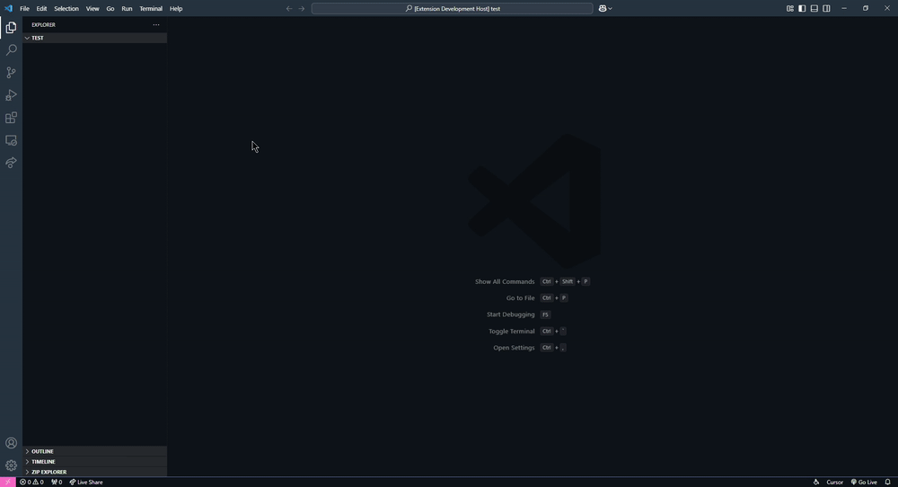

# Just a neash tool to have in my school

# How it works

## structure generator

You right click on a blank space or a folder in explorer and fill out the rest. Then you're baisically good to go.

## Fast Pastebin

You can just write the command `Open Pastebin link` in console and put the end code without writing pastebin.com every time

Alternatively you can press `ctrl+alt+p` in a file to achieve the same result

# Settings

`mateninjasTweaks.htmlLang` - lets you decide if you are from Poland or not